# What does a programmer do?

---

<!-- .element id="me" data-background="#8fcbdc" -->

## Katja Mordaunt

- &nbsp;katjamordaunt&#64;gmail.co.uk<!-- .element class="icon-envelop"-->
- &nbsp;katjam<!-- .element class="icon-github" -->
- &nbsp;elmlang: katjam<!-- .element class="icon-slack" -->

Note:
(1 min)
- Developing software in small teams about 15 years. Work with charities to build digital tools that compliment their over-stretched services

---

## Assumptions

<!-- .element class="inline" -->
<!-- .element class="inline" -->

Note:
(2 min)
- Technically, I am a computer scientist or web engineer, but really, I just like to make stuff and I use code to do that
- Don't need to be a mathematician nor a speedy typist to write reliable User Interfaces
- Just a person

+++

## Reality

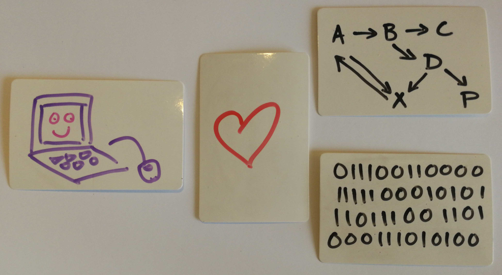<!-- .element class="fragment inline" data-fragment-index="1" -->
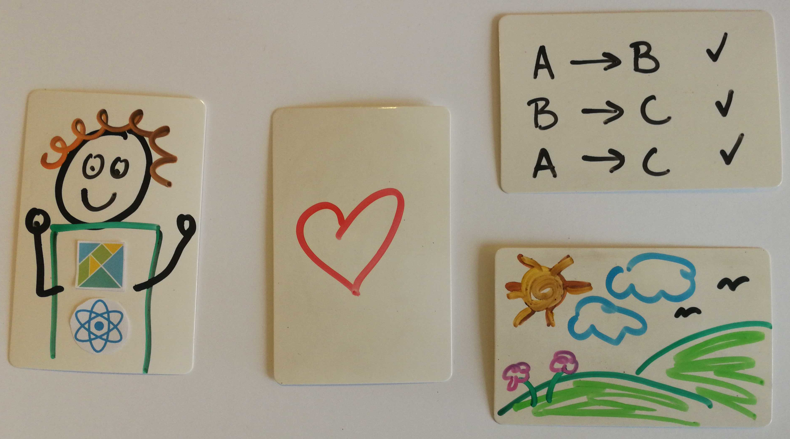<!-- .element class="fragment inline" data-fragment-index="2" -->
- read and write<!-- .element class="fragment inline" data-fragment-index="3" -->
- learn and teach<!-- .element class="fragment inline" data-fragment-index="3" -->
- plan and make agreements<!-- .element class="fragment inline" data-fragment-index="3" -->
- create!<!-- .element class="fragment inline" data-fragment-index="4 -->

Note:
(3 min)
- computers do like 1's and 0's and they can handle complicated networks of information
- people like small pieces of information and pretty pictures
- different depending on company and project
- used to get requirements and write the code 
- coder jobs exist too - code to spec - hire developers in india or china
- most programmers do all of these things in different proportions
- (tick) I spend my days talking to people, breaking down problems
- (tick) process & activity that makes a thing

---

<!-- .element id="app-venture" data-transition="zoom" data-background="#8fcbdc" -->

### What it means to...
## read and write
- code
- documentation
- blogs
- stack traces<!-- .element class="fragment inline" data-fragment-index="2" -->

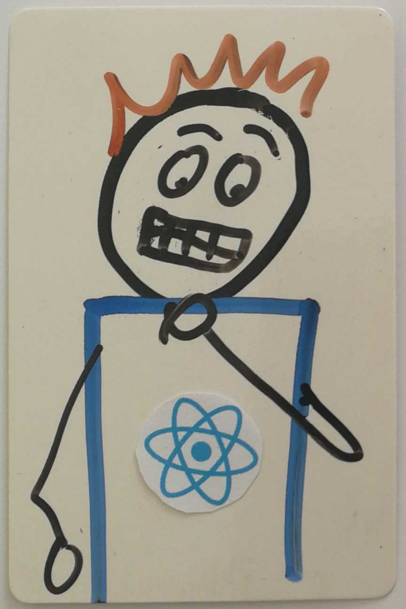<!-- .element class="wonk-img fragment inline" data-fragment-index="2" -->
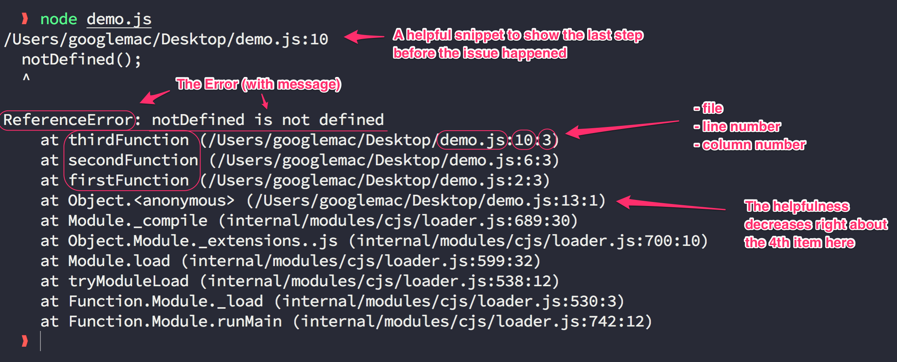<!-- .element class="fragment inline" data-fragment-index="2" -->

Note:
(6 min)
- ultimately we need to tell the computer what we want it to do in every eventuality
- later if what we want it to do changes, someone else - or us will have to understand the instructions we wrote so they can be altered
- if the technology changes
- messages from the computer
- if someone does something we weren't anticipating, they find a bug - beacause computers are not intelligent - they only know how to do the things we program them to do

+++

### What it means to...
## teach and learn
- make mistakes
- teach each other
- ask for help
- learn new things

<!-- .element class="fragment inline" data-fragment-index="2" -->
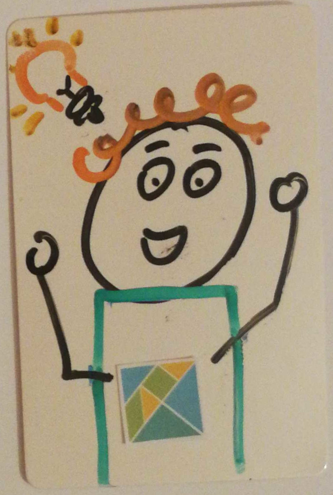<!-- .element class="wonk-img fragment inline" data-fragment-index="2" -->
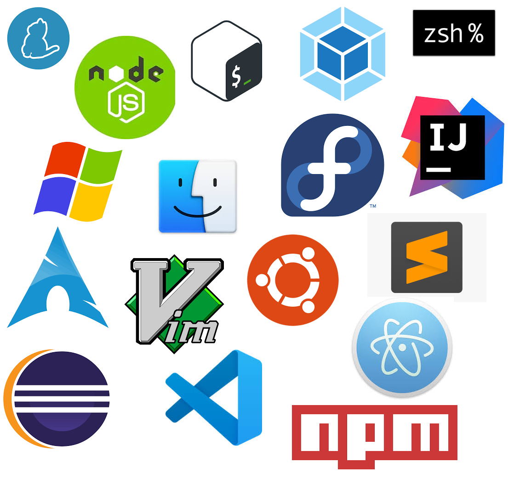<!-- .element class="fragment inline" data-fragment-index="2" -->

Note:
(9 min)
- team effort
- teach through pairing and code review
- just a few of the tools used in last 5 years for 1 part of job frontend web development
- need to help each other keep up to date - one brain is not big enough for all of this

+++

### What it means to...
## plan and make agreements
- make plans
- change plans
- agree what complete means
- agree tools to use
- know when to re-use
- know when to start again
- agree deadlines

Note:
(12 min)
- anything is possible, so it's important to narrow down priorities
- the further into implementation, the more likely need to change
- before starting work, agree what acceptance criteria
- team needs to agree on tools and process
- reuse vs bespoke on many levels
- sometimes it all goes wrong or the plan changes so much, it's better to start again
- Not like other products, software is never finished and it needs to be updated to remain compatible with devices and technologies we use.

---

### How we...
## create

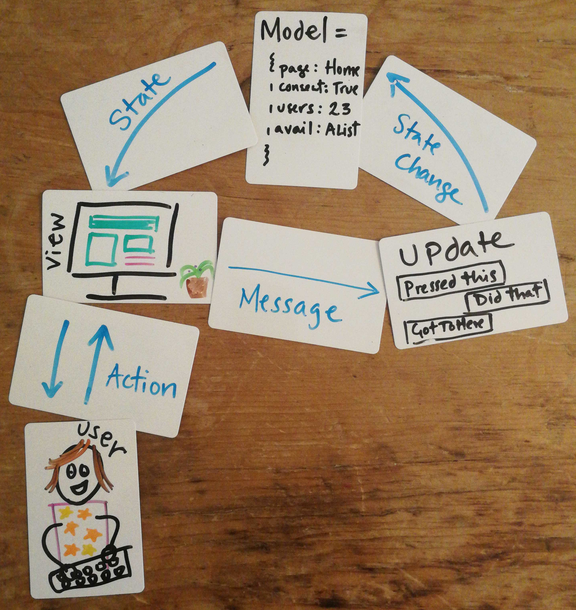<!-- .element class="fragment large-img" data-fragment-index="4"-->

share - build - test - design - fix

humble - inquisitive - flexible- methodical

Note:
- Use structured problem solving allows us to create together and predictably
- Patterns known templates that work in situations are our tool kit

+++

Shared patterns and structure

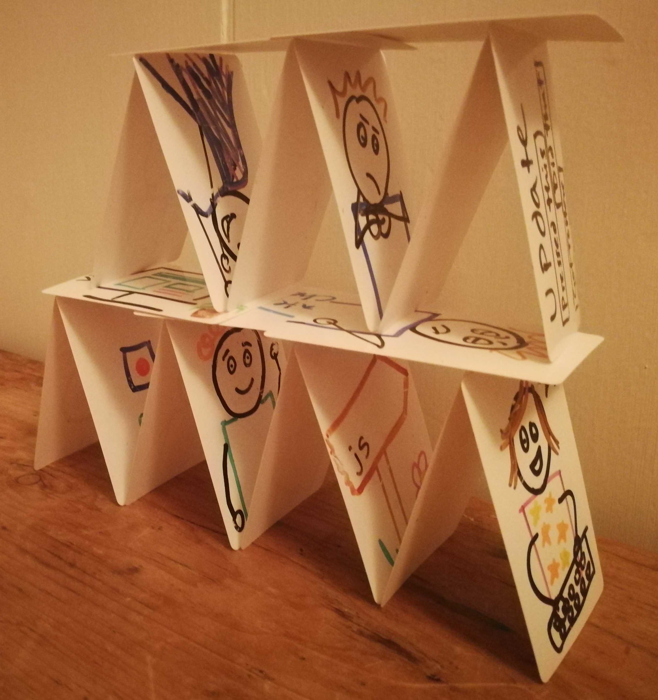<!-- .element class="fragment inline" data-fragment-index="1"-->
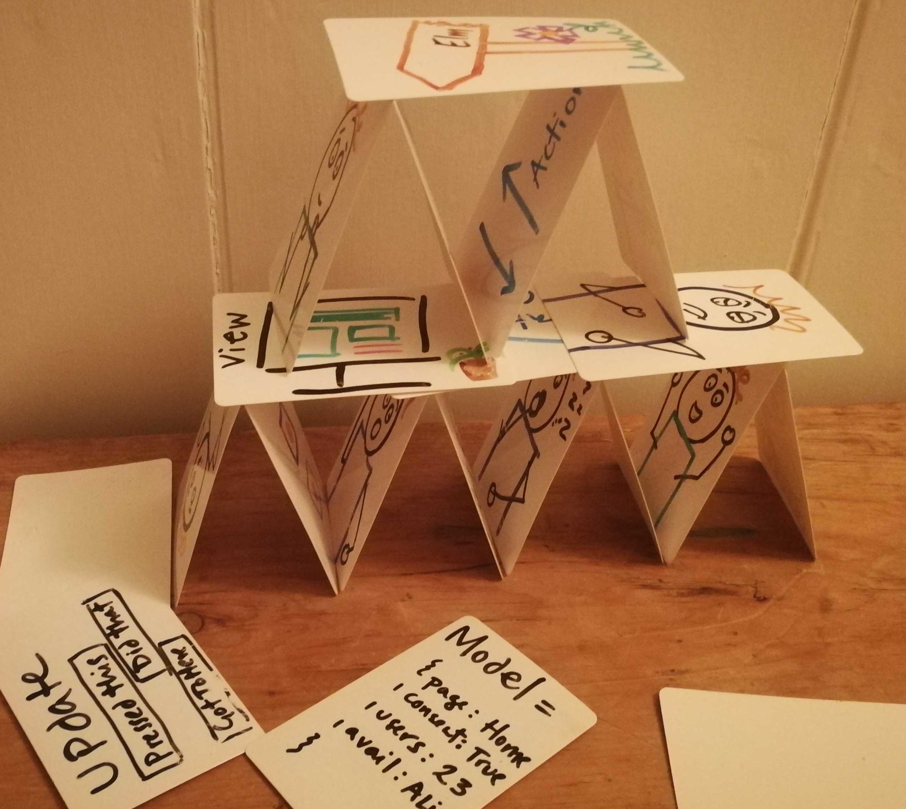<!-- .element class="fragment inline" data-fragment-index="2"-->
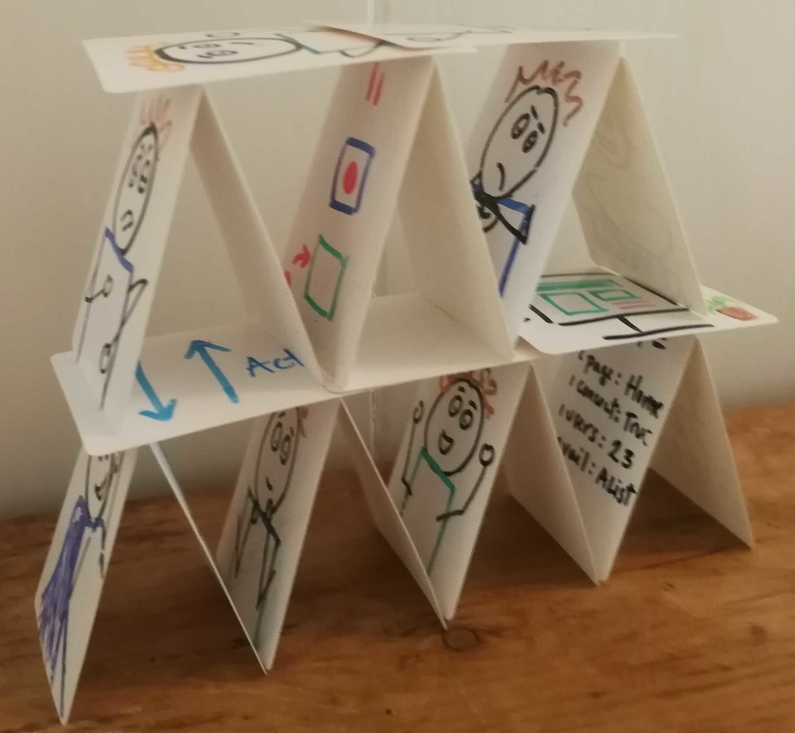<!-- .element class="fragment inline" data-fragment-index="3"-->
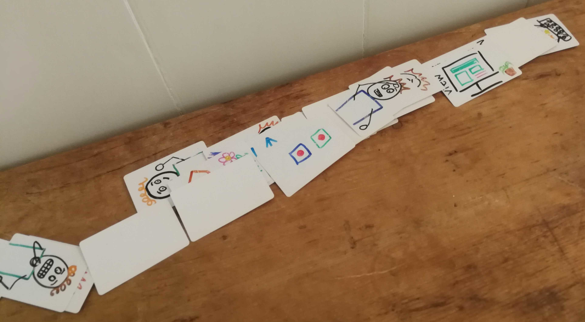<!-- .element class="fragment inline" data-fragment-index="4"-->

Engineering

Note:
(14 min)
- Not so different to other engineering disiplines
- Our ultimate goal is reliable apps
- Shared patterns and structure allow us to create together & learn from each other to make systems so complicated a single person could not possibly understand all the parts
- Like a house of cards - what you do will be added to
- Write code that is easy to understand later
- We have a finite amount of time. Try to spend it building, testing and designing features; not discovering, discussing and fixing bugs.
- only as strong as it's foundations, architecture and sum of it's parts

---

<!-- .element id="thanks" data-background="#8fcbdc" -->

>> In this world, the ability to write code has become not just a desirable skill but a language that grants insider status to those who speak it. They have access to what in a more mechanical age would have been called the levers of power.

Jason Tanz, Wired Magazine 2016

### Questions?<!-- .element class="fragment inline" data-fragment-index="1"-->

&nbsp;katjamordaunt&#64;gmail.co.uk<!-- .element class="fragment inline icon-envelop" data-fragment-index="1"-->
#### or ask me now!<!-- .element class="fragment inline" data-fragment-index="1"-->

Note:
(15 min)
