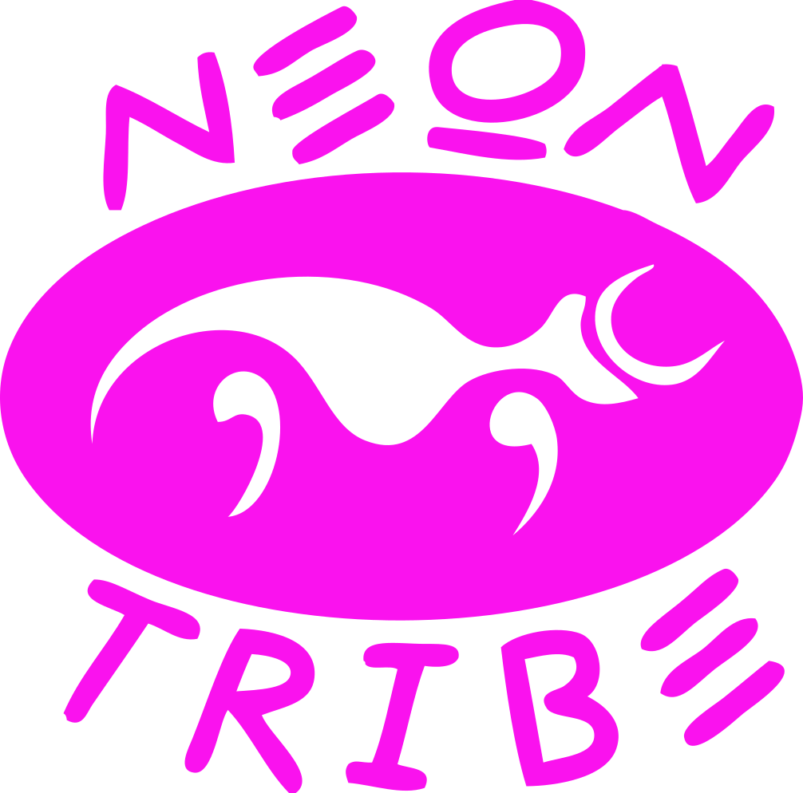

# What does a programmer do?
### a single example

---

<!-- .element id="me" data-background="#8fcbdc" -->

## Katja Mordaunt

- &nbsp;katja&#64;neontribe.co.uk<!-- .element class="icon-envelop"-->
- &nbsp;@neontribe<!-- .element class="icon-twitter" -->
- &nbsp;katjam<!-- .element class="icon-github" -->
- &nbsp;elmlang: katjam<!-- .element class="icon-slack" -->

Note:
(1 min)
- Developing software in small teams over decade with Neontribe. Work with non-profits to build digital tools that compliment their over-stretched services
- I don't identify as a computer scientist or engineer - I just like using code to make stuff
- not a mathematician nor a category theorist... sometimes I wish I was, but you don't need to know it to write reliable User Interfaces
- I love javascript - surprise my colleagues, clarify - I don't like reading or writing javascript
- universally supported & flexible target as standard on majority of our devices
- It's also pretty neat how small the initial learning curve is.

---

## Assumptions

Your skills & knowledge - not the same as mine

**You might think**<!-- .element class="fragment" data-fragment-index="2"-->
- New is fun & old is safe<!-- .element class="fragment" data-fragment-index="2"-->
- Popular is reliable & niche is fragile<!-- .element class="fragment" data-fragment-index="3"-->

**You probably value**<!-- .element class="fragment" data-fragment-index="4"-->
- Safety & efficiency<!-- .element class="fragment" data-fragment-index="4"-->
- Client trust<!-- .element class="fragment" data-fragment-index="5"-->
- Un-stressful collaboration<!-- .element class="fragment" data-fragment-index="6"-->

Note:
(3 min)
- You're probably a lot better at writing javascript than I am - because don't do it very much
- TICK: Might think new tech is fun - but old tech is safer - new to you does not mean new.
- functional 1930's, ML syntax 1973 - React Elm Typescript Webpack 2012/ 2013 - graphql, redux 2015
- You might think popular tech is reliable and niche tech is fragile - carefully engineered specialist equipt
- TICK: Like me, you proably want to write reliable software 
- TICK that you can be proud of
- TICK and feel confident when others collaboate with you on your code

+++

## This talk is not

<!-- .element class="fragment" data-fragment-index="1" -->
<!-- .element class="fragment inline" data-fragment-index="2" -->
<!-- .element class="fragment inline" data-fragment-index="2" -->

Note:
(3 min)
- TICK: A functional programming primer
- TICK: Intended to diss javascript
- Intended to make anyone feel bad about their tools and choices

+++

## This talk is
<!-- .element class="fragment" data-fragment-index="1" -->
<!-- .element class="fragment" data-fragment-index="2" -->

Note:
(4 min)
- Probably going make wrong assumptions about modern react
- TICK OK because less about tech, more asking think about humans & computers good at. Great some brains process & retain info around complex networks & code connections - but if you are writing inclusive code remember most of us can't. And if new to coding or to the project, you probabably won't be aware that the complexity exists. TICK Humans are awesome. We have imagination... but lead to complication particularly during creative collab
- TICK my focus is to tell you little about why I like Elm and how it helps make happier, more productive team. But more important, how we can help each other write better code and have better conversations
- Exposing some of the benefits of functional, static typing along the way

---

<!-- .element id="app-venture" data-transition="zoom" data-background="#8fcbdc" -->

## A Tale of 2 App-ventures

<!-- CONCLUDE AND SUMMARY -->

If programming is your job, it isn't supposed to be fun...

<!-- .element class="fragment inline" data-fragment-index="1"-->
<!-- .element class="fragment inline" data-fragment-index="2"-->
<!-- .element class="fragment inline" data-fragment-index="3"-->
<!-- .element class="fragment" data-fragment-index="4"-->

but it should make you feel proud.<!-- .element class="fragment" data-fragment-index="5"-->

Note:
(38 min)
- Our ultimate goal is reliable apps
- Your job should not include unneccessary stress
- Wanted ot make an impressive house of cards - realise scaffolding would have helped
- If you are writing code that's hard for some of your team to understand, you won't feel proud.
- We have a finite amount of time. Try to spend it building, testing and designing features; not discovering, discussing and fixing bugs.

---

<!-- .element id="thanks" data-background="#8fcbdc" -->

## Thank you

- &nbsp;katja&#64;neontribe.co.uk<!-- .element class="icon-envelop"-->
- &nbsp;@neontribe<!-- .element class="icon-twitter" -->
- &nbsp;katjam<!-- .element class="icon-github" -->
- &nbsp;elmlang: katjam<!-- .element class="icon-slack" -->

Note:
(40 min)
- Support of Neontribe and the Elm community
- Come find me later with questions or get in touch
