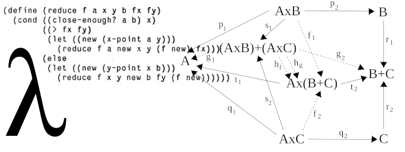

# What does a programmer do?

---

<!-- .element id="me" data-background="#8fcbdc" -->

## Katja Mordaunt

- &nbsp;katjamordaunt&#64;gmail.co.uk<!-- .element class="icon-envelop"-->
- &nbsp;katjam<!-- .element class="icon-github" -->
- &nbsp;elmlang: katjam<!-- .element class="icon-slack" -->

Note:
(1 min)
- Developing software in small teams about 15 years. Work with non-profits to build digital tools that compliment their over-stretched services
- I don't identify as a computer scientist or engineer - I just like using code to make stuff
- not a mathematician nor a speedy typist don't need that to write reliable User Interfaces

---

## Assumptions

TODO hacker gifs

<!-- .element class="fragment" data-fragment-index="1" -->
Note:
(2 min)

+++

## Reality

<!-- .element class="fragment inline" data-fragment-index="2" -->
<!-- .element class="fragment inline" data-fragment-index="2" -->

- read and write
- learn and teach
- plan and make agreements

- create

Note:
(3 min)
- different depending on company and project
- most programmers do all of these things in different proportions
- coder jobs exist too - code to spec - some companies that want to work like that hire developers in india, china or russia

---

<!-- .element id="app-venture" data-transition="zoom" data-background="#8fcbdc" -->

## What it means to read and write
- write code
- read code
- read documentation
- write documention
- read blogs
- write blogs
- read stack traces

Note:
(6 min)
- ultimately we need to tell the computer what we want it to do in every eventuality
- later if what we want it to do changes, someone else - or us will have to understand the instructions we wrote so they can be altered
- if the technology changes 
- if someone does something we weren't anticipating, they find a bug - beacause computers are not intelligent - they only know how to do the things we program them to do

## What it means to teach and learn
- make mistakes
- teach each other
- ask for help
- learn new things
- code review

Note:
(9 min)

## What it means to plan and make agreements
- make plans
- change plans
- agree what complete means
- agree tools to use
- agree deadlines

Note:
(12 min)

<!-- CONCLUDE AND SUMMARY -->
## What it means to create

- all of those activities combine to problem solving so we can create

Practice
- share
- build
- test
- design
- fix

Qualities
- humble
- inquisitive
- flexible
- methodical

If programming is your job, it isn't supposed to be fun...

<!-- .element class="fragment inline" data-fragment-index="1"-->
<!-- .element class="fragment inline" data-fragment-index="2"-->
<!-- .element class="fragment inline" data-fragment-index="3"-->
<!-- .element class="fragment" data-fragment-index="4"-->

but it should make you feel proud.<!-- .element class="fragment" data-fragment-index="5"-->

Note:
(14 min)
- Our ultimate goal is reliable apps
- Like a house of cards - what you do will be added to
- Write code that is easy to understand later
- We have a finite amount of time. Try to spend it building, testing and designing features; not discovering, discussing and fixing bugs.

---

<!-- .element id="thanks" data-background="#8fcbdc" -->

## Questions?

Ask me now

-or-

email me later &nbsp;katjamordaunt&#64;gmail.co.uk<!-- .element class="icon-envelop"-->

Note:
(15 min)
